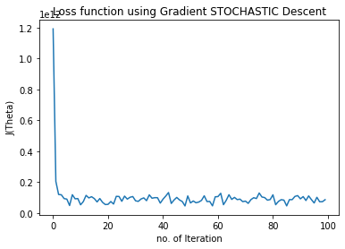
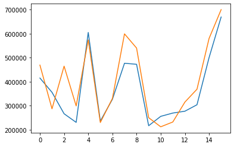
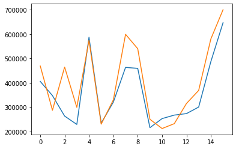
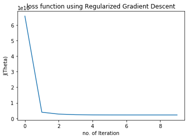

# Linear Regression and Gradient Descent

```python
from sklearn.model_selection import train_test_split
import matplotlib.pyplot as plt
import numpy as np
import pandas as pd

data = pd.read_csv("/path")
data.head(1)
data.shape
data.head()

```

### Feature scaling for Multivariate Problem

[Why is Feature Scaling Important](https://scikit-learn.org/stable/auto_examples/preprocessing/plot_scaling_importance.html)


```python
data =data.values
m=len(data[:,-1])
X=data[:,0:2].reshape(m,2)
mean=np.mean(X,axis=0)
std=np.std(X,axis=0)
X = (X - mean)/std
X = np.append(np.ones((m,1)),X,axis=1)
y=data[:,-1].reshape(m,1)
theta=np.zeros((3,1))

```

## Closed-Form Equation Vs Gradient Descent Vs Stochastic Gradient Descent

[Explain the differences between alternative approaches to estimating the parameters of a model](https://sebastianraschka.com/faq/docs/closed-form-vs-gd.html)

### Closed-form formula or Normal Equation


```python
XT=X.T
XTX=XT@X

inv=np.linalg.pinv(XTX)

thetanew=(inv@XT)@y
print(thetanew)
```

    [[89597.90954361]
     [  139.21067402]
     [-8738.01911255]]


### Cost Function


```python
def computeCost(X,y,theta):
    m=len(y)
    err=((np.dot(X, theta)) - y)**2
    jtheta = (np.sum(err) *( 1/ (2*m)))
    return jtheta
```


```python
computeCost(X,y,theta)

```


    65591548106.45744


### Gradient Descent


```python
def gradientDescent(X, y, theta, alpha, iterations):

    m = len(y)
    history = []
    for i in range(iterations):
        descent = alpha * 1 / m * (np.dot(X.transpose(), ((np.dot(X,theta)) - y)))
        theta -= descent
        history.append(computeCost(X, y, theta))

    return theta, history
```


```python
thetanew1,chistory1= gradientDescent(X,y,theta,1,50)
print(thetanew1)
```

    [[340412.65957447]
     [109447.79646961]
     [ -6578.35485416]]


```python
plt.plot(chistory1)
plt.xlabel("no. of Iteration")
plt.ylabel("J(Theta)")
plt.title("loss function using Gradient Descent")
```


    Text(0.5, 1.0, 'loss function using Gradient Descent')


### Stochastic Gradient Descent/

```python
def stocashtic_gradient_descent(X, y, theta, alpha, iterations):

    m = len(y)
    cost_history = np.zeros(iterations)

    for i in range(iterations):
        cost = 1.0
        for j in range(m):
            rand_ind = np.random.randint(0, m)
            Xi = X[rand_ind, :].reshape(1, X.shape[1])
            yi = y[rand_ind].reshape(1, 1)
            descent = (1 / m) * alpha * (Xi.transpose().dot(((np.dot(Xi, theta)) - yi)))
            theta -= descent
            cost += computeCost( Xi, yi, theta)
        cost_history[i] = cost

    return theta, cost_history
```


```python
thetanew2,chistory2 = stocashtic_gradient_descent(X,y,theta,1,100)
print(thetanew2)
```

    [[333857.22454677]
     [104732.15569427]
     [ -7188.6376759 ]]


```python
n_iter = 100
theta = np.random.randn(3,1)
plt.plot(range(n_iter),chistory2)
plt.xlabel("no. of Iteration")
plt.ylabel("J(Theta)")
plt.title("Loss function using Gradient STOCHASTIC Descent")
```

    Text(0.5, 1.0, 'Loss function using Gradient STOCHASTIC Descent')





```python
X_train, X_test, y_train, y_test = train_test_split(X, y, test_size=0.33, random_state=42)
m = len(y_train)
computeCost(X_train,y_train,thetanew1)

```

    1654614139.0828218


```python
computeCost(X_test,y_test,thetanew1)

```

    2796320254.1728415


```python
computeCost(X_train,y_train,thetanew2)

```

    1636964355.6928473


```python
computeCost(X_test,y_test,thetanew2)

```

    2833744177.3070307


```python
thetap1,phistory1 = gradientDescent(X_train,y_train,theta,0.2,50)
print(thetap1)
```

    [[319924.75939214]
     [ 93648.11271015]
     [ -2496.78859906]]


```python
thetap2,phistory2 = stocashtic_gradient_descent(X_train,y_train,theta,0.2,90)
print(thetap2)
```

    [[321087.62748613]
     [ 91245.71339344]
     [ -3415.62095041]]


```python
predictions1 = []

for i in range(0,16) :
    predict1= np.dot(thetanew1.transpose(),X_test[i])
    predictions1 = np.append(predictions1,predict1)
plt.plot(predictions1)
plt.plot(y_test)

```




```python
predictions = []

for i in range(0,16) :
    predict= np.dot(thetanew2.transpose(),X_test[i])
    predictions = np.append(predictions,predict)
plt.plot(predictions)
plt.plot(y_test)

```




```python
eval1,ehistory1 = gradientDescent(X_test,predictions1,theta,0.08,150)
print(thetap1)
eval2,ehistory2 = gradientDescent(X_test,y_test,theta,0.08,150)

predictions = []
for i in range(0,16) :
    predict= np.dot(thetap2.transpose(),X_test[i])
    predictions = np.append(predictions,predict)
print(predictions)
```

    [381901.00005848 336311.78918155 253740.50903145 222780.39041256
     545581.6271754  227460.40834332 305580.70764912 440592.18871572
     436872.17446306 210780.34443624 244380.47316992 250609.53324454
     262860.54397345 280369.6472658  455221.28097376 612323.81046984]


```python
testtheta1,ethistory1 = gradientDescent(X_test,y_test,theta,0.1,400)
print(testtheta1)

```

    [[376464.08973221]
     [108344.58280849]
     [ -1408.17517797]]


```python
m1=len(predictions)

ypred=predictions.reshape(m1,1)
eval1,ehistory1 = gradientDescent(X_test,ypred,theta,0.08,150)
print(eval1)

```

    [[318537.53041957]
     [ 94344.63835206]
     [ -1437.15342375]]


```python
m1=len(predictions)

ypred=predictions.reshape(m1,1)
eval1,ehistory1 = gradientDescent(X_test,ypred,theta,0.08,150)
print(eval1)


def computeCostR(X,y,theta,Lambda):

    m=len(y)
    predictions=X.dot(theta)
    square_err=(predictions - y)**2
    cost = 1/(2*m) * np.sum(square_err)
    regcost = cost + Lambda/(2*m) * sum(theta**2)
    j_0= 1/m * (X.transpose() @ (predictions - y))[0]
    j_1 = 1/m * (X.transpose() @ (predictions - y))[1:] + (Lambda/m)* theta[1:]
    grad= np.vstack((j_0[:,np.newaxis],j_1))
    return regcost[0], grad

computeCostR(X,y,theta,0.1)

```


    (2195587442.501597, array([[-1754.41032517],
            [-2677.15865359],
            [ 2644.26335941]]))


```python
def gradientDescentR(X,y,theta,alpha,num_iters,Lambda):

    m=len(y)
    history =[]

    for i in range(num_iters):
        cost, grad = computeCostR(X,y,theta,Lambda)
        theta = theta - (alpha * grad)
        history.append(cost)

    return theta , history

thetanew3 , chistory3 = gradientDescentR(X,y,theta,1,10,0.1)
print("The regularized theta using ridge regression:\n",thetanew3)
```

    The regularized theta using ridge regression:
     [[340412.65957447]
     [108768.39338594]
     [ -6362.50331981]]

```python
plt.plot(chistory3)
plt.xlabel("no. of Iteration")
plt.ylabel("J(Theta)")
plt.title("loss function using Regularized Gradient Descent")
```


    Text(0.5, 1.0, 'loss function using Regularized Gradient Descent')



